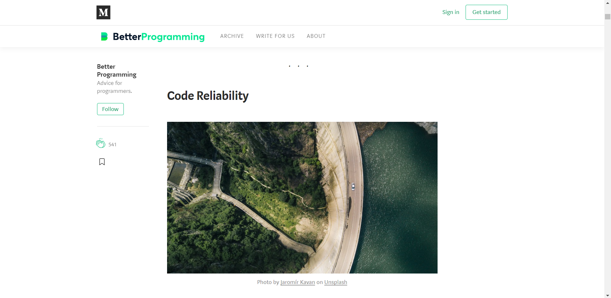
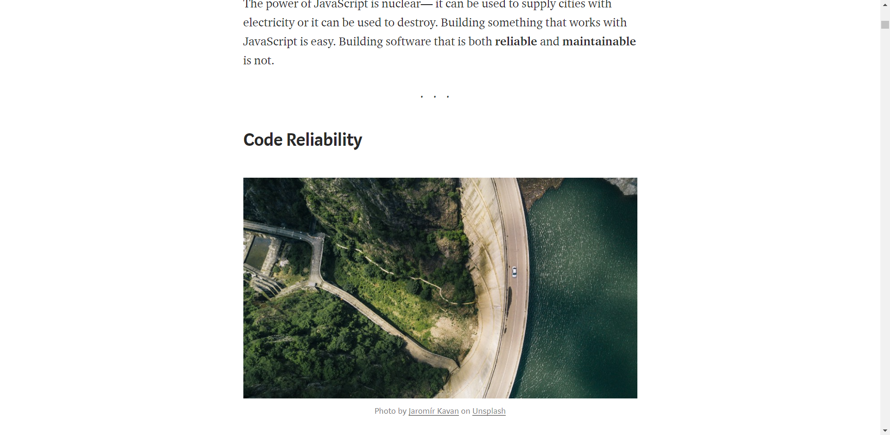

# StopAnnoyance

Extension to Google Chrome that can remove annoying elements from web pages.

## Usage examples

I use this extension to remove really annoying elements from web pages. Now extension can remove elements from:

- [Medium](https://medium.com/) (only from main domain).

| Medium before cleaning                                                                                                                  |
|-----------------------------------------------------------------------------------------------------------------------------------------|
|  |

| Medium after cleaning                                                                                                                  |
|----------------------------------------------------------------------------------------------------------------------------------------|
|   |

## Installation

This extension has not published in Chrome Web Store yet. But you can download repository and load extension as unpacked. More information you can find [here](https://developer.chrome.com/extensions/getstarted#manifest) (there is an instruction).
